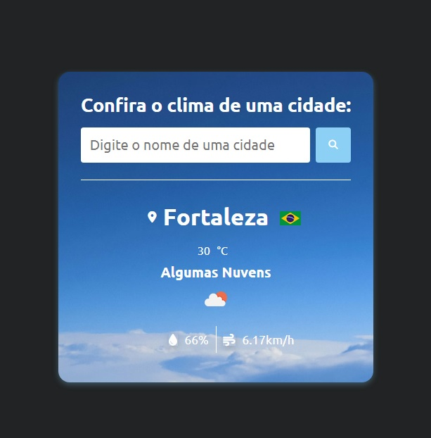

# Weather React.js App

- Weather React App é uma aplicação que permite a busca do clima de uma cidade ou país em tempo real.

- Este é um projeto de estudos já feito anteriormente em html, css e JavaScript puro e agora refiz usando React.

## Ferramentas usadas:
- [VScode](https://code.visualstudio.com/)
- [npm](https://www.npmjs.com/)
- [React.js](https://react.dev/) + [Vite](https://vitejs.dev/)
- [OpenWeatherMap](https://openweathermap.org/api)
- [Country Flags API](https://flagsapi.com/)
- [Google Fonts](https://fonts.google.com/)
- [Font Awesome CDN Libs](https://cdnjs.com/libraries/font-awesome)

## Funções:
### getWeatherData: 
- Faz a requisição de dados da API com o método fecth, transforma para o formato JSON e retorna os dados para serem manipulados.

### showWeatherData:
-  Recebe os dados da função anterior, faz a manipulação dos mesmos atribuindo os respectivos valores aos estados das variáveis para serem mostradas.

### onSubmit:
-  Atribui o valor digitado ao parâmetro da função que faz a requisição e dispara a função para manipular e mostrar os dados.

## Hooks:
- useState
- useRef

## Outros:
 - Conditional onChange
 - Conditional rendering
 - Style atribute change
 - Font-awesome CND
 - Css 
 
 ## Como instalar:
 - Certifique-se de ter as ferramentas Node.js e Npm instaladas  no seu sistema.
 - Clone este repositório.
 - Acesse a pasta do projeto e instale as dpenências.
 - Rode o comando npm run dev.
 - Acesse a aplicação pelo navegador no endereço http://localhost3000.

 ## Como usar:
 - Ao iniciar, aparecerá a interface com o campo para inserir o nome da cidade que deseja e um botão de busca.
 - Digite uma cidade e click no botão de busca.
 - Abaixo aparecerá uma sessão com os resultados como: o nome da cidade com a bandeira do respectivo país ao lado, temperatura, cobertura de nuvens, humidade e velocidade do vento.

## Minhas informações:

[linkedin.com/in/edilanio-amaral](http://www.linkedin.com/in/edilanio-amaral)

 

